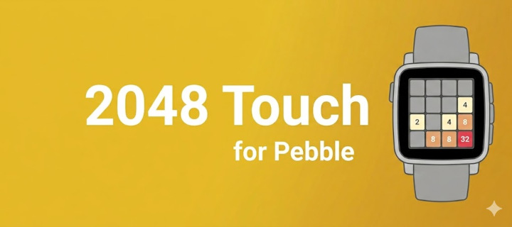
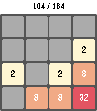
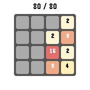
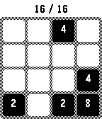

# 2048 for Pebble



The 2048 sliding-tile game for Pebble smartwatches. Supports touch swipes on
touch-capable models (emery) and physical buttons on the rest.

Install from the app stores:

- Core Devices: <https://apps.repebble.com/6df87b64b7174448a065ef54>
- Rebble: <https://apps.rebble.io/en_US/application/6a0567d11cbe56000ae6c9a8>

## Screenshots

| Pebble Time 2 (emery) | Pebble Time Round (chalk) | Pebble 2 (diorite) |
| :---: | :---: | :---: |
|  |  |  |

## Store description

Play the classic 2048 sliding-tile puzzle on your Pebble. Combine matching
numbered tiles to add them together and work your way up to the 2048 tile —
and beyond.

Swipe to move on touch-capable Pebbles, or use the physical buttons on every
other model. Your board, score, and high score are saved automatically, so
you can put the watch down and pick the game back up anytime. Long-press
SELECT to start a new game, long-press BACK to exit.

Supports Pebble Classic, Pebble Time, Pebble Time Round, Pebble 2, Pebble
Time 2, Pebble 2 Duo, and Core Devices Pebble.

## Controls

| Gesture | Action |
| --- | --- |
| Swipe (touch models) | Move tiles in the swipe direction |
| UP | Up |
| DOWN | Down |
| SELECT (tap) | Right |
| BACK (tap) | Left |
| SELECT (long press) | Reset game prompt |
| BACK (long press) | Exit app |

## Build & install

```sh
pebble build
pebble install --emulator emery     # emulator
pebble install --phone <IP>          # real watch
```

## Layout

```text
src/c/
  main.c       app entry / init / deinit
  game.{h,c}   board state, moves, scoring, persistence
  ui.{h,c}     layer hierarchy, rendering, animations, reset overlay
  input.{h,c}  touch swipes and button click handling
```

Game state, score, and high score persist across launches.

## Supported platforms

aplite, basalt, chalk, diorite, emery, flint, gabbro.
